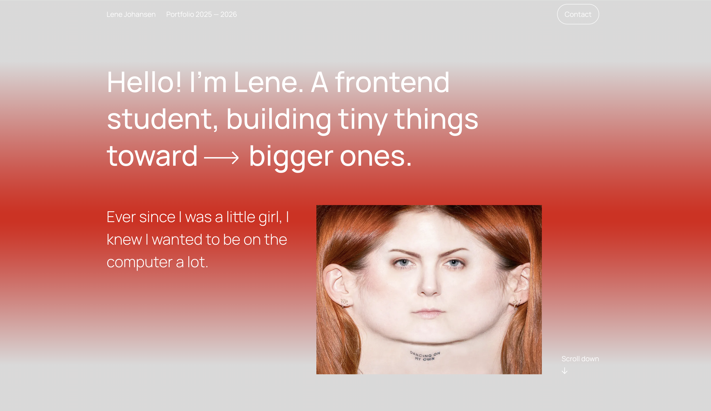

# Portfolio 1



A personal portfolio website built to present selected front end development projects, skills, and contact details in a clean and responsive layout.

## Description

This project was developed as part of the Front End Development program at Noroff. The goal was to design and build a portfolio website that showcases my work and demonstrates core front end skills using HTML, CSS, and JavaScript.

The website presents a small selection of projects with links to live sites and GitHub repositories. It also includes a short introduction and a simple way for visitors to get in touch.

The project focuses on:

- Responsive layout for mobile and desktop
- Clean and structured CSS
- Reusable components
- Clear project presentation
- Simple JavaScript interactions

## Built With

- HTML
- CSS
- JavaScript

## Getting Started

### Installing

Clone the repository:

```bash
git clone https://github.com/8headswillroll8/portfolio-1.git
```
